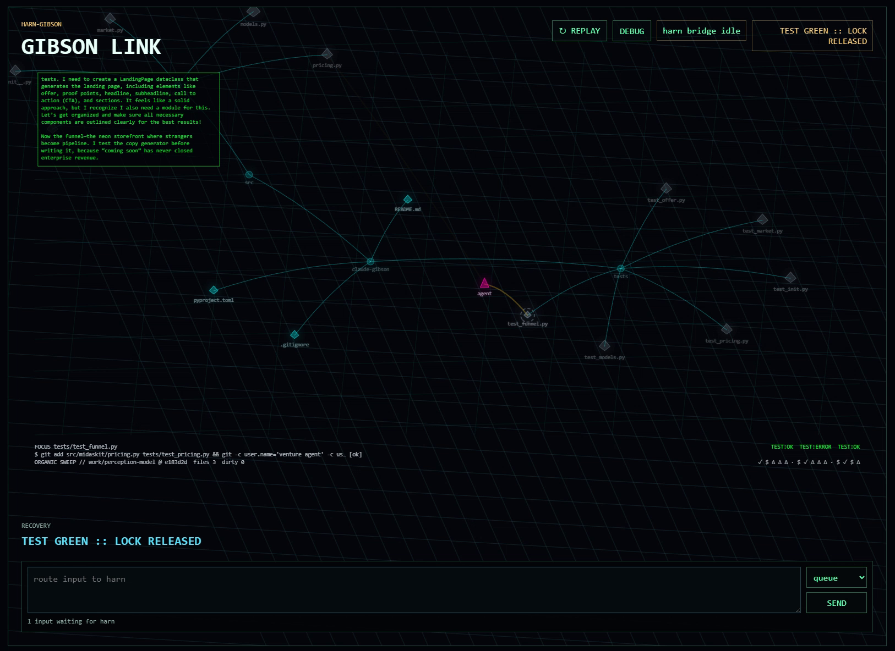

# harn-gibson

`harn-gibson` adds a cinematic browser viewer to a live [secemp9/harn](https://github.com/secemp9/harn) agent session. The normal setup has three steps:

1. install harn;
2. install the Gibson harn package into your configured harn;
3. start the browser viewer from harn with `/gibson-view`.

The viewer is a display layer. Harn remains the primary agent interface, and the browser can also queue small follow-up or steering messages back into harn.



## Quick Start: Interactive Viewer

Install harn, then add Gibson as a harn package:

```bash
harn install git:github.com/xlr8harder/harn-gibson
```

For a team/project-local install, write the package to `.harn/settings.json` instead:

```bash
harn install git:github.com/xlr8harder/harn-gibson -l
```

Then launch harn normally from your project:

```bash
harn
```

Inside harn, open the viewer:

```text
/gibson-view
```

That command starts a local Gibson display server, opens the browser, flushes recent harn events into the scene, and streams future events as the agent works.

Gibson does not require separate model credentials. Use your existing harn provider/auth configuration.

Useful variants:

```text
/gibson-renderers
/gibson-view --renderer default
/gibson-view --renderer classic
/gibson-view --renderer stress
/gibson-view --port 8765
/gibson-view --no-browser
```

`/gibson-view` uses the `default` visualization when no renderer is specified. `/gibson-renderers` lists the built-in visualization names. `default` is the built-in organic force-layout visualization driven by the perception model, `classic` is the older hard-coded coherent visualizer, and `stress` is the busy showcase/stress visualizer.

## Browser Input

The browser page includes a small composer. Submitted text is queued on the Gibson server and delivered into harn by the extension.

Delivery modes:

- `queue`: default. Runs immediately if harn is idle, or queues as a follow-up if harn is streaming.
- `steer`: queues steering input for the active agent run.

Runtime diagnostics, tracebacks, raw events, render intents, and hook decisions are available in the browser debug drawer.

## One-Command Run

If you want Gibson to own the whole local process tree for a demo or test run, use the launcher:

```bash
uv run harn-gibson run -- -p "summarize this repo"
```

This starts the viewer, opens the browser, imports existing Codex CLI OAuth credentials into harn's user auth store, and launches harn with the extension wired in. `run` uses the same `default` visualization as `/gibson-view`.

## Capture And Replay

Capture a live harn/Gibson session:

```bash
uv run harn-gibson capture --event-log test-artifacts/captures/manual.jsonl -- -p "summarize this repo"
```

Convert the captured JSONL into a replay fixture:

```bash
uv run harn-gibson event-log-to-replay test-artifacts/captures/manual.jsonl \
  --output test-artifacts/replays/manual.json \
  --visual-fixture
```

Conversion redacts common token/key/password/credential fields and token-looking substrings such as `Bearer ...`, `sk-...`, and GitHub token prefixes, replacing them with `[redacted]` and recording a count in fixture metadata. This is heuristic: it does not scrub arbitrary prompts, paths, tracebacks, proprietary output, or unusual secret formats, so review fixtures before committing them.

Watch the replay with fixed pacing:

```bash
uv run harn-gibson watch-replay test-artifacts/replays/manual.json
```

Use source timestamps when you want captured event timing:

```bash
uv run harn-gibson watch-replay test-artifacts/replays/manual.json --playback-timing real-time
```

Replay does not need harn. It feeds captured events through the same scene pipeline and browser backend.

## How It Works

The harn extension subscribes to harn events and normalizes them into sequenced `GibsonEvent`s. The display server receives those events, routes them through the renderer/projection pipeline, and streams scene updates to the browser over SSE. The browser owns smooth presentation details such as animation clocks, scrolling panels, and canvas rendering.

The default visualization is built from a perception model: entities such as files, directories, commands, checks, commits, and the agent cursor; relations such as `contains`, `touched`, `produced`, and `focused_on`; and event history. A projection turns that model into a scene, currently an organic force-layout Gibson map.

Sessions can be captured to JSONL with `HARN_GIBSON_EVENT_LOG`, converted into replay fixtures, and re-rendered later with different projections or renderer adapters.

## Development

For a local checkout:

```bash
uv sync
uv run pytest
```

Coverage is enforced at 100% for the Python package.

To run harn with the package loaded transiently:

```bash
uv run harn -e .
```

Or install the checkout into your harn settings:

```bash
harn install /path/to/harn-gibson
```

Advanced launcher, capture, replay, renderer adapter, fixture, and acceptance workflows live in [docs/development.md](docs/development.md). Architecture and replay details live in [docs/architecture.md](docs/architecture.md), [docs/launch-modes.md](docs/launch-modes.md), [docs/replay.md](docs/replay.md), and [docs/renderer-agent.md](docs/renderer-agent.md).

The 1.0 release boundary is defined in [docs/1.0-feature-set.md](docs/1.0-feature-set.md).

## Browser Tests

```bash
uv run playwright install chromium
uv run pytest
```

Browser screenshots are written to `test-artifacts/screenshots/`.

## Hook Modules

Hook modules are Python files listed in `HARN_GIBSON_HOOKS`, separated by `:`. Each module exports `register_gibson_hooks(dispatcher)`.

```python
from harn_gibson import HookDecision


def register_gibson_hooks(dispatcher):
    @dispatcher.on("tool_call", "before")
    def block_rm(event):
        command = event.payload.get("input", {}).get("command", "")
        if "rm -rf" in command:
            return HookDecision(block=True, reason="Blocked by harn-gibson hook")
```

Supported interdict points include `input`, `tool_call`, `tool_result`, `message_end`, `before_agent_start`, and session-before events. All harn lifecycle/display events are still emitted even when they do not support mutation.
