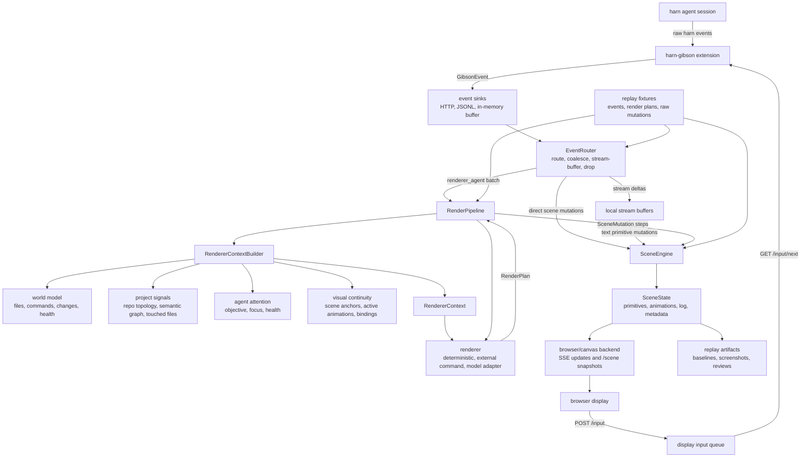

# Architecture Diagram

This is the high-level data flow for harn-gibson. The core idea is that harn remains the agent runtime, while harn-gibson observes events, builds renderer context, applies scene mutations, and displays the resulting scene.

## Responsibilities

- `harn-gibson extension`: normalizes harn events into `GibsonEvent`, forwards them to configured sinks, and polls queued browser input back into harn.
- `EventRouter`: decides whether an event should update scene state directly, enter a stream buffer, go to a renderer, be debug-only, or be dropped/sampled.
- `RendererContextBuilder`: prepares the compact prompt/runtime context for renderers. It owns the accumulated world model and combines it with repo topology, semantic graph, touched files, agent attention, current scene state, visual continuity, object-level target anchors, and catalog data.
- `renderer`: turns context into a `RenderPlan`. Current renderers can be deterministic Python, an external JSON command, or the prompt-command model adapter.
- `SceneEngine`: applies `SceneMutation` objects to persistent `SceneState`, including primitive updates, animation lifecycle/TTL pruning, logs, metadata, and render-intent history.
- `display backend`: renders `SceneState`. The browser/canvas backend is current, but a non-web backend can consume the same scene snapshots and mutation protocol.
- `replay`: feeds recorded events, saved render plans, or raw mutations through the same boundaries and records baselines, screenshots, reviews, and renderer-context artifacts.

## Main Contracts

- Events: `harn-gibson.event.v1`
- Renderer context: `harn-gibson.renderer-context.v1`
- World model: `harn-gibson.world-model.v1`
- Semantic graph: `harn-gibson.semantic-repo-graph.v1`
- Render plan: `harn-gibson.render-plan.v1`
- Scene state: `harn-gibson.scene.v1`
- Scene update: `harn-gibson.scene-update.v1`
- World bindings: `harn-gibson.world-binding.v1`
